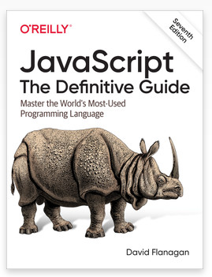
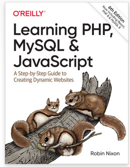
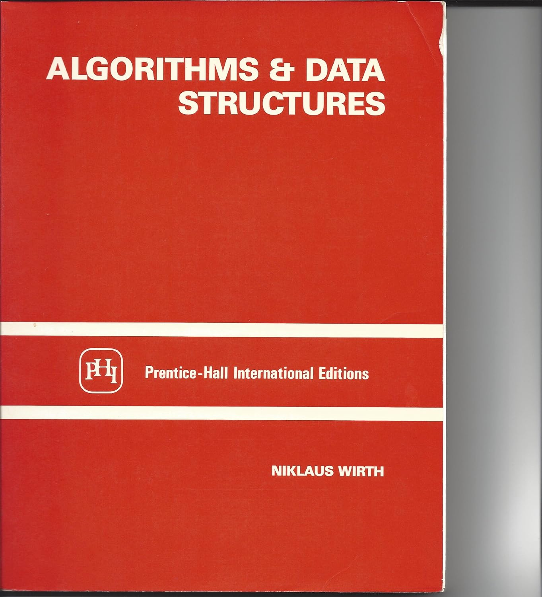

# Développement côté client avec Javascript

Ce dépôt contient tout le code source Javascript (et HTML) du module *Développement Front-End* (côté client), 1ère année (B1). Vous y retrouverez les démos réalisées en cours, les exercices et leurs corrections.

- [Développement côté client avec Javascript](#développement-côté-client-avec-javascript)
  - [Utiliser le dépôt](#utiliser-le-dépôt)
    - [Prérequis](#prérequis)
    - [Récupérer le contenu du dépôt](#récupérer-le-contenu-du-dépôt)
  - [Démos](#démos)
  - [Module 02 - Premiers pas avec Javascript](#module-02---premiers-pas-avec-javascript)
  - [Module 03 - Les objets Javascript](#module-03---les-objets-javascript)
  - [Module 04 - Pages web dynamiques](#module-04---pages-web-dynamiques)
  - [Références](#références)
    - [Documentation officielle](#documentation-officielle)
    - [Ouvrages](#ouvrages)

## Utiliser le dépôt

Vous pouvez consulter le contenu du dépôt directement sur le web, comme n'importe quel site web. Vous pouvez également télécharger le contenu sous forme d'archive en cliquant sur `Code` (bouton vert) puis `Download ZIP`.

Comme le contenu du dépôt va évoluer au cours du temps, le mieux est d'utiliser le programme [git](https://git-scm.com/). Avec git, vous allez pouvoir **récupérer tout le contenu *à jour* du dépôt en une seule commande**.

### Prérequis

Télécharger et installer [git](https://git-scm.com/downloads) pour votre système d'exploitation.

> Sur macOs et GNU/Linux, vérifier que le programme `git` est sur le `PATH`.

### Récupérer le contenu du dépôt 

Ouvrir un terminal. 

> Sur Windows, vous pouvez utiliser l'application Git Bash (installée avec git), qui est un terminal dédié à git.

Vérifiez l'installation de Git en tapant simplement `git` dans votre terminal. Si `git` est correctement installé, vous devriez voir une liste de commandes. Sinon, assurez-vous que `git` est inclus dans votre variable d'environnement `PATH`, qui répertorie les emplacements où le programme est recherché lorsque vous souhaitez le lancer. 

> Comment ajouter un répertoire au `PATH` ? [Voir comment faire sur Windows](https://learn.microsoft.com/fr-fr/previous-versions/office/developer/sharepoint-2010/ee537574(v=office.14)), [comment faire sur macOS](https://quick-tutoriel.com/ajouter-rapidement-un-nouveau-repertoire-au-path-de-mac-osx/).

Au besoin, déplacez-vous dans un dossier de votre choix avec la commande `cd`. Cloner le dépôt avec la commande suivante :

~~~bash
git clone https://github.com/paul-schuhm/developpement-cote-client-js
~~~

Le dépôt est téléchargé sur votre machine dans le dossier `developpement-cote-client-js`. Pour récupérer le contenu mis à jour, ouvrez un terminal à l'emplacement du dépôt (dans le dossier `developpement-cote-client-js`) puis lancez la commande

~~~bash
git pull
~~~

Toutes les mises à jour (nouvelles démos, corrections, exercices, etc.) seront téléchargées automatiquement sur votre machine.

## Démos

- [Accéder aux démos](./demos/)
- [Accéder aux démos faites en cours (live)](./demos/0live/)

## Module 02 - Premiers pas avec Javascript

- [Accéder aux exercices](./exercices/module-02-exercices.md)
- [Accéder à la correction des exercices](./exercices/corrections/)

## Module 03 - Les objets Javascript

## Module 04 - Pages web dynamiques

- [Accéder à la correction des exercices](./exercices/module-04/)

> Les propositions d'exercice sont présentes sur la dernière page du support de cours PDF du module 4.

## Références

### Documentation officielle

- [Les bases de JavaScript](https://developer.mozilla.org/fr/docs/Learn/Getting_started_with_the_web/JavaScript_basics) de la MDN pour apprendre la déclaration et l'utilisation de variables
- [Principaux blocs en JS](https://developer.mozilla.org/fr/docs/Learn/JavaScript/Building_blocks) de la MDN, pour apprendre l'usage des conditions, des boucles et l'écriture de fonctions. [Faire l'auto-évaluation](https://developer.mozilla.org/fr/docs/Learn/JavaScript/Building_blocks/Image_gallery)
- [Notre premier code JavaScript](https://developer.mozilla.org/fr/docs/Learn/JavaScript/First_steps/A_first_splash)
- [JavaScript asynchrone](https://developer.mozilla.org/fr/docs/Learn/JavaScript/Asynchronous) de la MDN, pour apprendre les bases de la programmation asynchrone. [Faire l'évaluation](https://developer.mozilla.org/en-US/docs/Learn/JavaScript/Asynchronous/Sequencing_animations)

### Ouvrages

- [JavaScript: The Definitive Guide, 7th Edition](https://www.oreilly.com/library/view/javascript-the-definitive/9781491952016/), de David Flanagan, publié chez O'Reilly, 2020. La 6e edition couvre le standard ECMAScript 5 (celle actuellement implémentée par les navigateurs) et reste donc une référence solide. Trouvable pour une dizaine d'euros en occasion
- [Développer un site web en PHP, MySQL JavaScript jQuery, CSS3 et HTML5: Un guide étape par étape pour créer des sites web dynamiques, 6e edition](https://www.amazon.fr/D%C3%A9velopper-MySQL-JavaScript-jQuery-HTML5/dp/2893776183/ref=sr_1_1), un excellent ouvrage pour découvrir l'écosystème du web (développement client, serveur). [Disponible en ligne ici](https://github.com/domaingood/learning_php/blob/master/Learning%20PHP%2C%20MySQL%20%26%20JavaScript%2C%206th%20Edition.pdf). [La version 5 est trouvable facilement](https://www.amazon.fr/D%C3%A9velopper-Mysql-Javascript-Jquery-HTML5/dp/2893775764/ref=sr_1_2) se trouve facilement en occasion ou en ligne
- [Algorithmes + datastructures](https://www.amazon.fr/Algorithms-Data-Structures-Niklaus-Wirth/dp/0130219991), de Niklaus Wirth (RIP), publié chez Longman Higher Education, 1986. Une référence pour apprendre à écrire des programmes. Trouvable en ligne facilement
