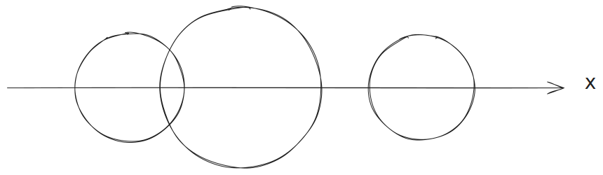

# Exercices - Module 3 : Les objets Javascript

B1 - Développement Front (Javascript)

Auteur : Paul Schuhmacher

Version : 1

- [Exercices - Module 3 : Les objets Javascript](#exercices---module-3--les-objets-javascript)
  - [Exercice 1 : Gestion des étudiant·es](#exercice-1--gestion-des-étudiantes)
  - [Exercice 2 : Manipuler les tableaux comme des objets](#exercice-2--manipuler-les-tableaux-comme-des-objets)
  - [Exercice 3 : Manipuler les chaînes de caractères comme des objets](#exercice-3--manipuler-les-chaînes-de-caractères-comme-des-objets)
  - [Exercice 4 : Fonctions constructeur et formes géométriques](#exercice-4--fonctions-constructeur-et-formes-géométriques)
    - [Exemple d'utilisation](#exemple-dutilisation)

## Exercice 1 : Gestion des étudiant·es

1. Créer un objet `student1` (sans fonction constructeur) représentant un·e étudiant·e avec les propriétés suivantes :
    - Name
    - Age
    - Courses (une liste de matières suivies par l'étudiant·e, par exemple, Mathématiques, Histoire, Informatique, etc.)

`student1` contient les informations sur Jane, âgée de 25 ans qui étudie les matières suivantes : Arts, Sociology et Computer Science.

2. Créer un deuxième objet `student2` (toujours sans fonction constructeur) avec les mêmes propriétés, mais des informations différentes. Cette fois-ci, `student2` contient les informations sur John, âgé de 23 ans et qui étudie les matières suivantes : Computer Science,  Biology.
3. Écrire une fonction `printStudent(student)` qui prend un objet étudiant en argument et affiche les informations de l'étudiant·e de la manière suivante :

~~~bash
Name : Jane
Age : 25 ans
Courses: Arts - Sociology - Computer Science

Name : John
Age : 23 ans
Courses : Computer Science - Biology
~~~

4. Ajouter une méthode `addCourse(course)` à l'objet étudiant qui permet d'ajouter une nouvelle matière à la liste des matières suivies.
5. Créer une fonction `calculateAverageAge(...students)` qui prend un nombre indéterminé d'étudiant·es et retourne la moyenne de leurs âges.
6. Écrire une fonction `findCommonCourses(etudiant1, etudiant2)` qui prend deux objets étudiants en argument et retourne la liste des matières qu'ils ont en commun.
7. **Créez une fonction constructeur** pour instancier des étudiant·es.
8. Modifier la structure d'un étudiant en remplaçant la propriété `Age` par `BirthDate`. Instancier de nouveaux étudiant·es avec cette nouvelle structure. Utiliser l'objet intégré [Date](https://developer.mozilla.org/fr/docs/Web/JavaScript/Reference/Global_Objects/Date) de Javascript pour générer des dates de naissance. Exemple d'usage : `let date = new Date(Year, Month, Day)`.
9.  Ajouter une méthode `age()` à l'objet étudiant qui calcule et retourne son age (en années). *Tip: Si vous calculez la différence entre deux dates vous obtenez la durée écoulée en millisecondes. Pour obtenir la date courante, instancier un objet Date : `let now = new Date()`*. 
10. Écrire une fonction qui retourne la liste des étudiant·es, ordonné du plus jeune au plus agé·e.

> [En savoir plus sur l'usage des dates en Javascript](https://developer.mozilla.org/fr/docs/Web/JavaScript/Reference/Global_Objects/Date)

## Exercice 2 : Manipuler les tableaux comme des objets

1. Créez un tableau appelé `numbers` contenant les nombres de 1 à 10.
2. Affichez le tableau `numbers` dans la console.
3. Ajoutez les nombres 11 et 12 à la fin du tableau.
4. Affichez à nouveau le tableau mis à jour dans la console.
5. [Trouvez et utilisez une méthode de tableau](https://developer.mozilla.org/fr/docs/Web/JavaScript/Reference/Objets_globaux/Array#M%C3%A9thodes) pour inverser l'ordre des éléments dans le tableau.
6. Affichez le tableau inversé dans la console.
7. Utilisez une méthode de tableau pour extraire et afficher les nombres entre 5 et 8 (inclus).
8. Utilisez une méthode de tableau pour vérifier si le nombre 3 est présent dans le tableau. Affichez le résultat dans la console.
9. Créez un nouveau tableau appelé `oddNumbers` contenant uniquement les nombres pairs du tableau `numbers`.
10. Affichez le tableau `oddNumbers` dans la console.
11. Trouvez une méthode pour transformer le tableau en chaîne de caractères, où chaque élément est séparé de l'autres par un slash (/).

## Exercice 3 : Manipuler les chaînes de caractères comme des objets

1. Écrire une fonction qui permet de tester si une chaîne de caractère passée en paramètre commence par une lettre majuscule ou minuscule entre 'a' et 'd'.
2. Écrire une fonction qui renvoie 'true' lorsque'une chaîne contient un seul caractère '@' sinon renvoie 'false'.
3. Écrire une fonction qui renvoie 'true' lorsque'une chaîne contient au moins un chiffre sinon renvoie 'false'.
4. Écrire une fonction qui remplace les chiffre par le caractère '*' .
5. [En vous aidant de la documentation](https://developer.mozilla.org/fr/docs/Web/JavaScript/Reference/Global_Objects/String), **trouver une méthode** qui permet de transformer la chaîne `let string = '13,14,15,16,17,18,19,20';` en un tableau de **nombres**.

> Source : www.exelib.net

## Exercice 4 : Fonctions constructeur et formes géométriques

1. Créez une fonction constructeur appelée `Rectangle` qui permet de fabriquer des rectangles. La fonction doit prendre en paramètre la largeur et la longueur du rectangle.

2. Créez une fonction constructeur appelée `Circle` qui permet de fabriquer des cercles. La fonction doit prendre en paramètre le rayon du cercle.

3. Ajoutez une méthode aux rectangles appelée `area()` qui calcule et affiche l'aire du rectangle. Faites de même pour les cercles.

4. Créez une liste de rectangles avec des côtés aléatoires entre 1 et 10 (largeur et longueur). Placez-les dans un tableau avec la méthode `push`. Trouvez le rectangle ayant la plus grande surface et affichez ses caractéristiques.

5. Créez des cercles de tailles aléatoires entre 1 et 10. Placez-les dans un tableau avec la méthode `push`. Pour chaque cercle, dressez la liste des autres cercles plus petits que lui.

6. Ajoutez une propriété de position `x` aux cercles. Créez 10 cercles avec des positions aléatoires entre 0 et 5, et des rayons compris entre 1 et 2. Ajoutez une méthode aux cercles nommée `isOverlapping(autreCercle): bool`. Cette méthode prend un cercle en argument et retourne vrai si les deux cercles se chevauchent, faux sinon. Écrivez une fonction qui retourne le nombre de cercles qui se chevauchent.

7. Ajouter une méthode `isClicked(clickPosition)` aux cercles qui prend en argument la position d'un click utilisateur (entre 0 et 7). Cette méthode retourne vrai si le click a été fait à l'intérieur du cercle, faux sinon.

### Exemple d'utilisation

~~~JS
// Exemple de création d'un rectangle
let myRectangle = new Rectangle(4, 6);
myRectangle.area();

// Exemple de création d'un cercle
let myCircle = new Circle(1, 3);
let myCircle2 = new Circle(2, 2);
myCircle.area();
myCircle.isClicked(5); // false
myCircle.isOverlapping(myCircle2); //true
~~~

>  Vous pouvez utiliser la fonction `Math.random()` pour générer des nombres aléatoires entre 1 et 10 pour les côtés des rectangles, les rayons des cercles, les positions x des cercles, etc.
